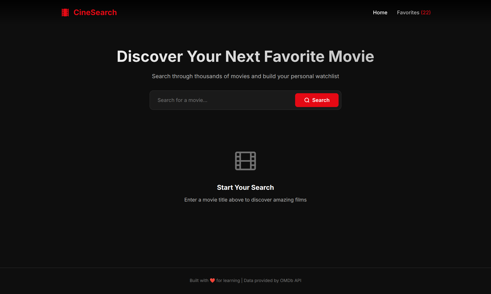
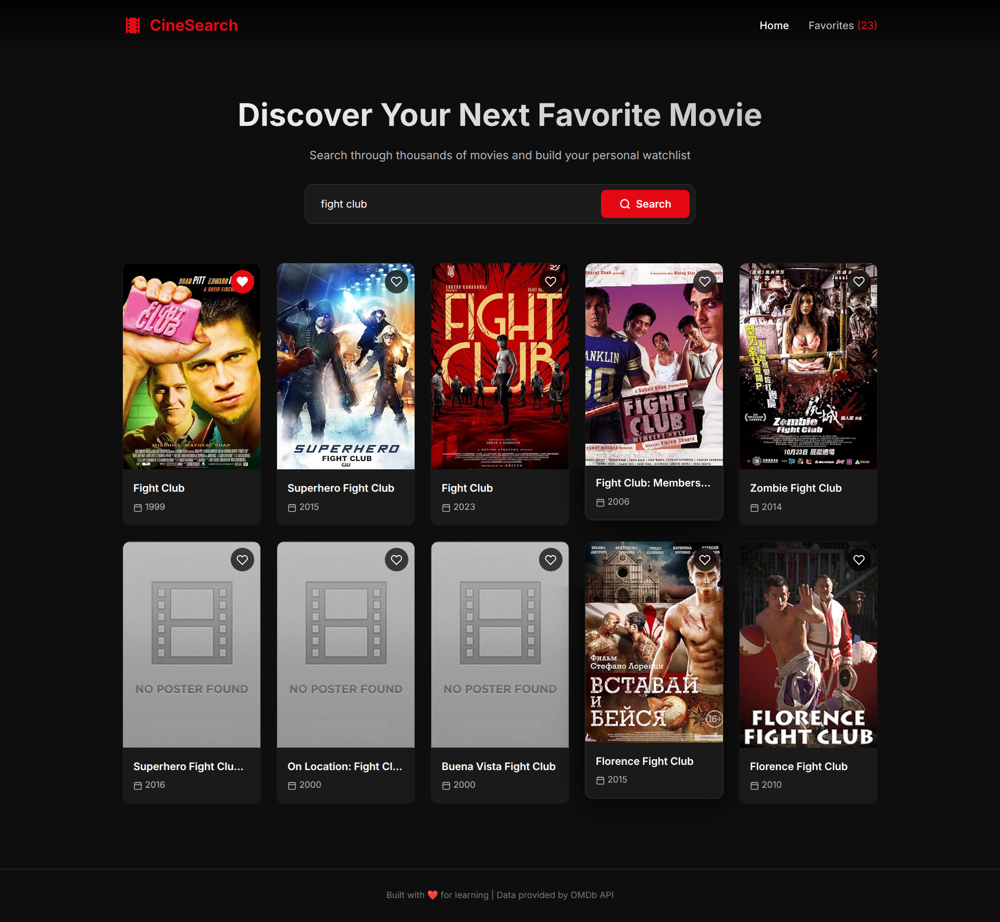
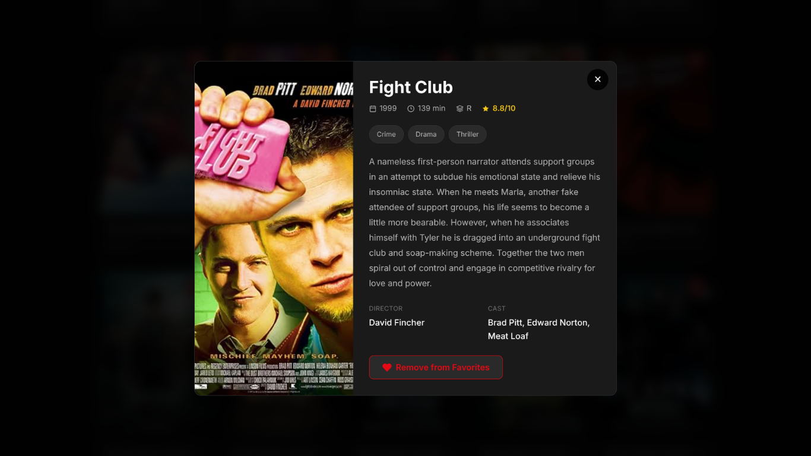

<p align="center">
  
  
  
  
</p>

# 🎬 CineSearch

A modern movie search application built with **Vanilla JavaScript**, allowing users to search thousands of movies, view detailed information, and save favorites using Local Storage.

> Built as part of my JavaScript learning journey to practice working with APIs, asynchronous programming, DOM manipulation, and state management.

---

## 📸 Preview


| Home | Movie Details |
|------|---------------|
| | |

---

## ✨ Features

- 🔍 Search movies by title
- 🎞 View movie details in a modal
- ❤️ Add and remove favorite movies
- 💾 Favorites saved using Local Storage
- ⚡ Loading spinner while fetching data
- 🚫 Error handling for failed requests
- 🔎 "No Results" state
- 📱 Fully responsive design
- 🎨 Modern UI

---

## 🛠 Built With

- HTML5
- CSS3
- JavaScript (ES6+)
- OMDb API
- Local Storage

---

## 📂 Project Structure

```
CineSearch/
│
├── img/
│   ├── default_poster.jpg
│   └── ...
│
├── index.html
├── style.css
├── script.js
└── README.md
```

---

## 🚀 Getting Started

Clone the repository

```bash
git clone https://github.com/ramiabdelghafour/cine-search.git
```

Open the project

```bash
cd cine-search
```

Open `index.html` in your browser.

---

## 🔑 API Key

This project uses the **OMDb API**.

Create your free API key here:

https://www.omdbapi.com/apikey.aspx

Replace the API key inside:

```javascript
const API_KEY = "YOUR_API_KEY_HERE";
```

---

## 📚 What I Learned

This project helped me practice:

- DOM Manipulation
- Event Delegation
- Fetch API
- Async / Await
- Error Handling
- State Management
- Local Storage
- Dynamic UI Rendering
- Responsive Design
- JavaScript Code Organization


## 📷 Screenshots

### Home


---

### Search Results


---

### Movie Details



---

### Favorites


---

## 📄 License

This project is open source and available under the MIT License.

---

## ⭐ If you enjoyed this project

If this project helped or inspired you, consider giving it a ⭐ on GitHub.
